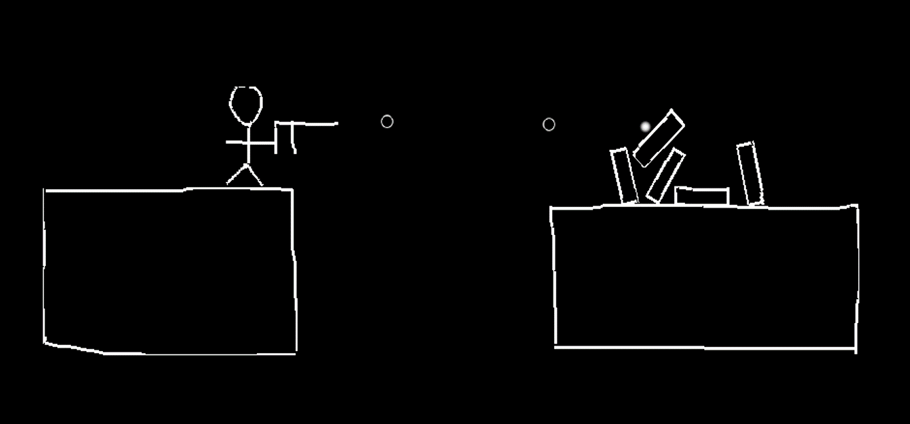
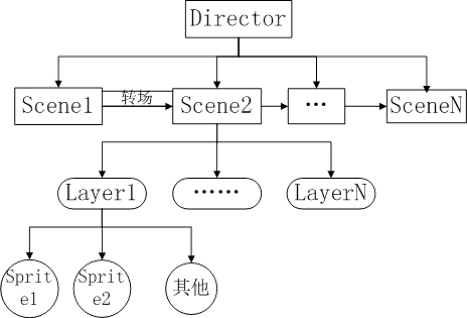
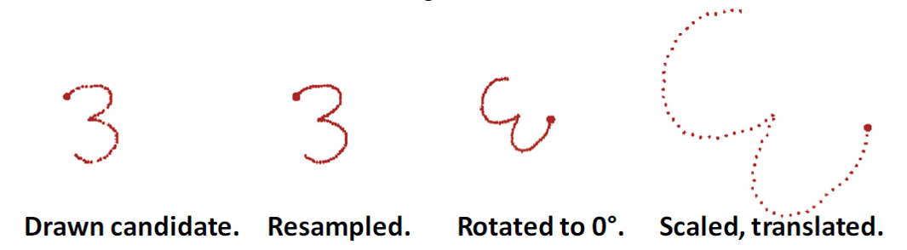
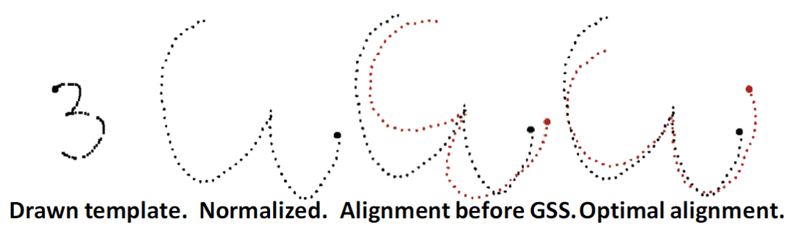
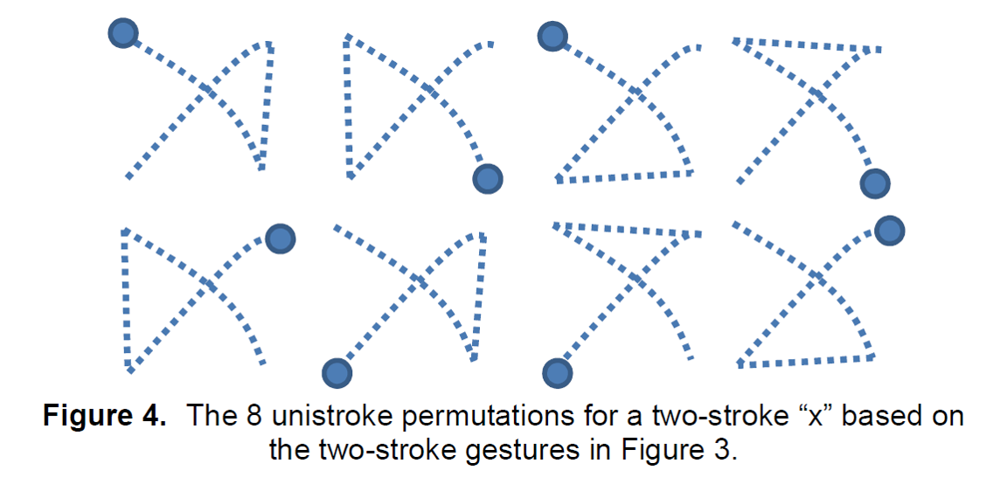

# SKetch2D Reference Guide

| Contributions |                                          |
| ------------- | ---------------------------------------- |
| Development   | Zak Penn - [microsmadiopenn@gmail.com](mailto://microsmadiopenn@gmail.com)     |
|               | Ziseon - [emengjzs@163.com](mailto://emengjzs@163.com) |
| Document      | Ziseon - [emengjzs@163.com](mailto://emengjzs@163.com) |

## 1. 总览

### 程序介绍

SKetch2D 是一个基于`Cocos2d`并结合手势识别技术的物理演示程序。它预设了多种物理模型，并提供手写识别设置，用户可以通过触控笔、鼠标或其他设备描绘物理模型，并根据现实中的物理规律对模型进行演示。本文档旨在对该演示程序的配置、原理、实现做简单介绍。



在程序中，默认提供了如下的物理模型或特性设置：

```C++
// mesh  物体模型
#define GT_MESH_TRIANGLE	"Triangle"        // 三角形
#define GT_MESH_RECTANGLE	"Rectangle"       // 矩形
#define GT_MESH_CIRCLE		"Circle"          // 圆形
#define GT_MESH_GROOVE		"Groove"          // 凹槽
#define GT_MESH_PAWN		"Pawn"            // 人
#define GT_MESH_PISTAL		"Pistal"          // 枪，可发子弹
#define GT_MESH_SPRING		"Spring"		  // 弹簧
#define GT_MESH_SWORD		"Sword"           // 剑
// mark  属性标记
#define GT_MARK_STATIC		    "Static"          // 设置物体为静态（不受重力影响）
#define GT_MARK_DELETE		    "Delete"          // 删除物体
#define GT_MARK_CHECK		    "Check"           // 设置控制物体，可使用键盘操作物体
```

### 文档总览

第二章说明了程序开发和运行的配置要求。第三章介绍程序实现所基于的游戏框架Cocos2d。第四章介绍手势识别实现算法\$1和\$N。第五章介绍程序的实现要点。

### 阅读基础

为了能更加明白本文档所述内容，建议读者就以下主题有熟悉的基础：

- C++11 
- 基础图形学知识

##  2. 项目配置

### 环境

- Windows 7/8/8/1/10
- Visual Studio **2013** (with Update5 更佳)， **Visual Studio 2015 不保证能够正确运行**。[下载地址](https://www.microsoft.com/zh-cn/download/confirmation.aspx?id=48144)
- Python 2.7 ，请确保已设置环境变量，在命令行下通过输入`python`检查。
- Git

### 配置步骤

下载Cocos2dx-3.10，[下载地址](http://www.cocos2d-x.org/filedown/CocosForWin-v3.10.exe)。

安装或解压完毕后，找到路径`\Cocos2d-x\cocos2d-x-3.10\tools\cocos2d-console\bin`，在该目录下执行如下命令（可将`~\Desktop`替换为希望项目存放的文件夹位置，执行后项目位于该文件夹内）：

```shell
python cocos.py new Sketch2D -p cn.edu.nju.software.sketch -l cpp -d ~\Desktop
```

在项目存放的文件夹上（即文件夹Sketch2D所在位置），执行命令

```shell
git clone https://github.com/mspenn/Sketch2D.git Sketch2D-src
```

将`Sketch2D-src\Classes`下所有的文件复制到`Sketch2D\proj.win32\src`文件夹中（如果没有则新建）。

将`Sketch2D-src\Resources`文件夹复制到`Sketch2D`文件夹下。

双击打开工程文件`Sketch2D\Sketch2D.sln`，启动Visual Studio。

在工程目录导航中右键`Classes`文件夹，设置为源文件。

启动调试，运行项目，第一次运行项目需要整个编译，时间较久，可能超过30分钟。

P.S: 每次绘制完成一个图形之后，请按Enter键确认识别。

## 3. 游戏引擎Cocos2dx基础 

为了实现在第一章介绍的物理演示程序，我们需要考虑其中的主要功能实现点。1.程序应该允许用户在屏幕上使用合适的设备（鼠标、触控笔等）描绘图形并实时显示，物理模型也应该能够在屏幕上显示出来。2. 系统应该能够通过用户描绘的线段，识别并构建出相应形状，进而判断该形状所属的物理模型。形状和物理模型的对应关系通过用户设置，这不是难点，但关键是需要识别出用户描绘的到底是什么形状。3. 构建物理模型，判断出需要构造的物理模型后，需要依据模型的特性构建物体，包括形状、大小，以及相应的物理特性，如弹簧则拥有弹性，子弹则拥有动能，等等。4. 碰撞检测，由于大部分物理模型都是实体，因此在进行模型演示时，物体和物体之间的碰撞效果也应该表现出来，那么判断两个物体是否发生了碰撞则是关键。5. 动画条件，进行模型演示时会涉及到物体的移动，尤其当考虑物理规律下，动画应该能够反应符合物理常理的物体运动。6. 演示和控制，最后程序应该允许用户在程序上进行操作，这说明需要基本的交互界面。


以上的实现工作如果全部自己实现是十分困难的，幸运的是，借助于已有的物理引擎游戏框架，我们可以省去以上大部分的工作。游戏引擎是指一些已编写好的可编辑游戏系统或者一些交互式实时图像应用程序的核心组件。这些系统为游戏设计者提供各种编写游戏所需的各种工具，其目的在于让游戏设计者能容易和快速地做出游戏程序而不用由零开始。一般，游戏引擎一般包括：图形引擎、物理引擎、音频引擎、网络通信、AI编程、资源管理、脚本逻辑编写支持等多个功能，有了以上的组件，我们可以更快速地开发出上述程序。

本程序选择了Cocos2d游戏框架作为开发基础。

### 流程架构

本节大部分内容源于http://www.cocos.com/docs/native/v3/basic-concepts/zh.html

本框架采用节点树形结构来管理游戏对象，一个游戏可以划分为不同的场景（即交互画面），一个场景又可以分为不同的层（可理解为图层），一个层又可以拥有任意个可见的游戏节点（即对象，游戏中基本上所有的类都派生于节点类Node，如精灵、UI组件等）。可以执行Action来修改游戏节点的属性，使其移动、旋转、放大、缩小等等。




#### 导演（Director）

一款游戏好比一部电影，只是游戏具有更强的交互性，不过它们的基本原理是一致的。所以在Cocos2dx中把统筹游戏大局的类抽象为导演（Director），Director像是整个游戏的导航仪，游戏中的一些常用操作就是由Director来控制的，比如OpenGL ES的初始化，场景的转换，游戏暂停继续的控制，世界坐标和GL坐标之间的切换，对节点（游戏元素）的控制等，还有一些游戏数据的保存调用，屏幕尺寸的获取等都要由Director类来管理控制的。

因为Director是游戏项目的总导演，会经常调用进行一些控制，所以该Director利用了单件设计模式，也就是项目里取到的director都是同一个。**用`getInstance()` 方法取得Director的实例**，调用如下例所示。

```C++
// CanvasScene.cpp 切换场景，CanvasScene是Scene的子类
if (EventKeyboard::KeyCode::KEY_ESCAPE == keyCode)
{
  auto scene = SceneManager::GetMenuScene();
  Director::getInstance()->replaceScene(scene);
}
```
#### 场景（Scene）

Scene场景也是cocos2dx中必不可少的元素，游戏中通常我们需要构建不同的场景（至少一个），游戏里关卡、版块的切换也就是一个一个场景的切换，就像在电影中变换舞台和场地一样。场景的一个重要的作用就是流程控制的作用，我们可以通过Director的一系列方法控制游戏中不同的场景的自由切换。下面是Director控制场景的常用方法：
| Method                         | Description                              |
| ------------------------------ | ---------------------------------------- |
| `runWithScene( Scene *scene )` | 启动游戏，并运行scene场景。本方法在主程序第一次启动主场景的时候调用。如果已有正在运行的场景则不能调用该方法 |
| `replaceScene( Scene *scene )` | 直接使用传入的scene替换当前场景来切换画面，当前场景被释放。这是切换场景时最常用的方法 |
| `popScene()`                   | 释放当前场景，再从代码执行场景中弹出栈顶的场景，并将其设置为当前运行场景。如果栈为空，直接结束应用。和PushScene结对使用 |
| `end()`                        | 释放和终止执行场景，同时退出应用                         |
| `pause()`                      | 暂停当前运行场景中的所有计时器和动作，场景仍然会显示在屏幕上           |
| `resume ()`                    | 恢复当前运行场景的所有计时器和动作，场景仍然会显示在屏幕上            |

同时场景是层的容器，包含了所有需要显示的游戏元素。通常，当我们需要完成一个场景时候，会创建一个Scene的子类，并在子类中实现我们需要的功能。比如，我们可以在子类的初始化中载入游戏资源，为场景添加层，启动音乐播放等等。

#### 层（Layer）

Layer是处理玩家事件响应的Node子类。**层相当于PS中的图层。**层通常包含的是直接在屏幕上呈现的内容，并且可以接受用户的输入事件，包括触摸，加速度计和键盘输入等。我们需要在层中加入精灵，UI组件或者其他游戏元素，并设置游戏元素的属性，比如位置，方向和大小；设置游戏元素的动作等。通常，层中的对象功能类似，耦合较紧，与层中游戏内容相关的逻辑代码也编写在层中，在组织好层后，只需要把层按照顺序添加到场景中就可以显示出来了。要向场景添加层，我们可以使用`addChild`方法。


### 两阶段构造

为了与Cocos2dx框架的设计风格保持一致，几乎所有的呈现元素（Scene、Layer、Sprite、Component、Node等继承类）均采用两阶段构造的设计编写。

第一阶段是运行C++类构造器。在C++类的默认构造器中，成员变量须设定为默认值，**不应在默认构造器中编写任何逻辑**。

第二阶段是调用`ClassT::init()`函数，此处编写任何需要初始化处理的逻辑。

另外，该类需要提供一个静态方法`ClassT::create()`，对这一两阶段构造器进行包装，使得只需调用该方法时便可得到完整的实例，该方法可以提供参数以便更好地初始化类。

一个典型的例子如下：

```C++
class ItemListLayer : public Layer
{
public:
  ItemListLayer(i) :           // 第一阶段
     _i(i) { }       
  ~ItemListLayer();     
  virtual bool init();         // 第二阶段 
  CREATE_FUNC(ItemListLayer);  // 包装方法，直接使用提供的宏CREATE_FUNC，不需自己实现
 
private:
   int _i;
}

bool ItemListLayer::init() 
{   
    if (Layer::init())  // 调用父类的init方法
    {
      // 此处初始化其他属于ItemListLayer中的UI组件
      return true;
    }
  return false;
}

// 实例化ItemListLayer，对于cocos2d中提供的类产生实例的方法都是一致的 XXX::create()
auto itemListLayer = ItemListLayer::create();
```
### UI组件

构造游戏的界面主要由各个UI组件完成，UI组件的设计和调用类似与Java中的Swing，简单熟悉后即可进行界面设计的工作。

UI组件一般有如下一些通用方法：

- `setPosition` 设置组件相对于所在节点的位置，**默认以组件的左下角为基准点，默认以节点的左下角为原点建立坐标参考系**
- `setAnchorPoint` 设置基准点
- `setContentSize`  设置组件大小
- `setScale` 设置放大倍数
- `addChild`将节点加入到父节点中

现介绍主要的几个UI组件。

- `cocos2d::ui::ListView`   可带滚动条的列表，其中可以放置一系列元素，**元素的加入请先用`ui::Layout`进行包装**，一个实例如下：


```C++
  ui::Layout *custom_item = ui::Layout::create();
  ...
  custom_item->addChild(item.getSprite());
  ...
  _scrollView->pushBackCustomItem(custom_item);     // 加入到列表中
```

- `cocos2d::ui::CheckBox` 选择框，通过`addEventListener`监听选择行为。

- `cocos2d::ui::Text` 文字

- `cocos2d::ui::Button` 按钮

其余组件及方法请参考 [这里](http://api.cocos.com/dd/df1/group__ui.html)

### 事件监听

所谓的事件即有四步：

1. 定义事件，事件可以是任意类型，其实只是对事件进行一个标识，以便可以区分其他事件。
2. 监听函数，声明感兴趣的事件，然后指定事件发生时所需要执行的函数，事件发生时一般带有上下文，监听函数可以获取事件发生时的具体信息。
3. 注册监听，通过`_eventDispatche`(所有`Node`类都有的私有变量)，注册监听函数，事件真正发生时，由它通知事件，进而触发了相应的监听函数。
4. 分发事件，当真正的事件发生时，创建事件实例，在需要为具体事件添加自定义的上下文时，可通过`event.setUserData(void*)`添加，后通过`_eventDispatcher->dispatchEvent(&event)`即可完成事件的派发。**解数据时需对类型进行转换**。

一些框架已经提供的事件，如点击事件、选择事件、键盘事件等，可省去步骤1、4，这些由框架完成。

详细内容请见 [这里](http://www.cocos.com/docs/native/v3/event-dispatcher/zh.html)

### 计时调度

在需要与时间有关的处理，如动画、定时任务等，需要使用调度器(scheduler)。调度要素包括：

1. 调度策略，只执行一次/周期性执行/延迟执行/取消执行
2. 调度方法，每次调度发生时所调用的方法。
3. 调度频率。

**请注意，在绑定调度方法时，请使用lambda表达式，不要使用实例中的`schedule_selector`宏，因为该宏没有绑定所指向的实例**，即函数签名`schedule(SEL_SCHEDULE selector,float interval, unsigned int repeat, float delay)`中第一个参数直接使用lambda表达式。

定时任务的取消需要在调度方法中判断结束条件并取消。

详细内容请见 [这里](http://www.cocos.com/docs/native/v3/scheduler/zh.html)

### 物理模型

cocos2dx 提供了物理模型的支持，cocos2d中通过在`Node`相关类上提供相应函数来设置是否应用物理引擎。物理世界被融入到Scene中，即当创建一个场景时，就可以指定这个场景是否使用物理引擎。对Sprite，可以通过`setPhysicsBody`设置物理属性，包括质量、密度、摩擦力等。对于碰撞检测，可以通过添加监听函数获取碰撞信息。

更详细的内容可以参考 [这里](http://blog.csdn.net/cbbbc/article/details/38541099)

**更多的关于Cocos2dx的教程可以参考[这里](http://www.cocos2d-x.org/docs/ProgrammersGuide.pdf)**


## 4. $1 与  $N

$1, $N与$P是Washington实验组研究出的关于手势识别的算法，三个基于不同的假设和方法实现对二维图案的识别。相关信息发表在http://depts.washington.edu/aimgroup/proj/dollar/index.html上。

$1是针对一笔画的二维图案的简单识别，它不事先对样本进行训练，换言之，它是一个lazy learner，使用最近邻居的分类算法（nearest-neighbor classifier ）寻找样本集中最接近于待分类图案的图形。它对样本和图案进行数据标准化（即数据转换）以提高匹配率。它将图案进行重采样，使得图案的线条是较为均匀的，之后，旋转图案，使得样本描绘的第一个点（即画的起始位置）和图案质心的连线都在同一个水平线上，对于待分类图案，也和样本进行重采样和旋转处理。之后，计算两者的相似度score，相似度以两者的“距离”进行度量，距离越大，score越小，表明两者越不相似。距离通过计算平均组成图案的对应各个点之间的欧氏距离得出。通过这种量化，找出样本中score最大的图案，即将待测图案归类为该图案。





\$N 是基于$1改进的可以识别多笔画的二维图案识别，和\$1一样，同样采取最近邻居的分类算法和欧氏距离计算两个图案的相似度，所不同的是，为了提高匹配率，算法根据笔画顺序以及图案四个方向对样例进行枚举，产生所有图案相同但笔画顺序和图案方向不同的样例集，这样针对输入图案相同但笔画顺序不一样的情况，该算法可以进行兼容并得出相应图案类别，一个待分类图案与样例集的“距离”定义为样例集中与待分类图案“距离”的最小值。



具体算法细节和研究成果请参阅[这里](http://depts.washington.edu/aimgroup/proj/dollar/index.html)所发表的文献。

## 5. 实现要点

### 凹多边形处理

由于cocos2dx对凹多边形的模型建立有问题（可能由于判断一个点是否在一个凹多边形内比较麻烦，用于物理模型中的碰撞检测），因此，对于凹多边形的物理图案，在建模时，需要把它转换为凸多边形。

转换凹多边形有两种方法，第一种是将多边形分割为多个三角形；第二种是直接在多边形的基础上计算出凸包作为物理模型。本程序实现上使用第二种。需要注意的是，在使用第二种方法时需要将边界点按照时针顺序排序，否则计算凸包时可能遇到困难。

凸包算法细节可参考源代码`geometry\GeometricMath.cpp`中的`ConvexHull`函数

### 碰撞约束

多个物体组成一个整体时需要对物体之间的碰撞设定约束，例如小车包括一个车架和两个轮子，如果这些物体之间不设置碰撞约束，则在物理环境下小车会散架。碰撞约束有多种类型，cocos2d使用了Chipmunk作为物理引擎实现，关于碰撞约束的种类和设置详见[这里](http://chipmunk-physics.net/release/ChipmunkLatest-Docs/)

### 非刚性物体处理

由于非刚性物体在发生碰撞时会发生形变，虽然PhysicalBody已经包含了关于非刚性物体的物理特性，但显示的图案还需要自己根据形变情况调整图案以符合物理规律。

细节可参考源代码`geometry\handler\CommandHandler.cpp`部分

### 多线程处理
由于cocos2d的渲染调度器使用一个单线程循环实现的，所以在涉及到多线程对节点的操作时，需要使用Director提供的接口：
```C++
Director::getInstance()->getScheduler()->performFunctionInCocosThread([&](){
  EventCustom e(EVENT_LOADING_TEMPLATE);
  LoadTemplateData ltd(loadingProgress, string("Activating Templates..."));
  e.setUserData((void*)&ltd);
  _eventDispatcher->dispatchEvent(&e);
});
```

更多细节请参考源代码。
