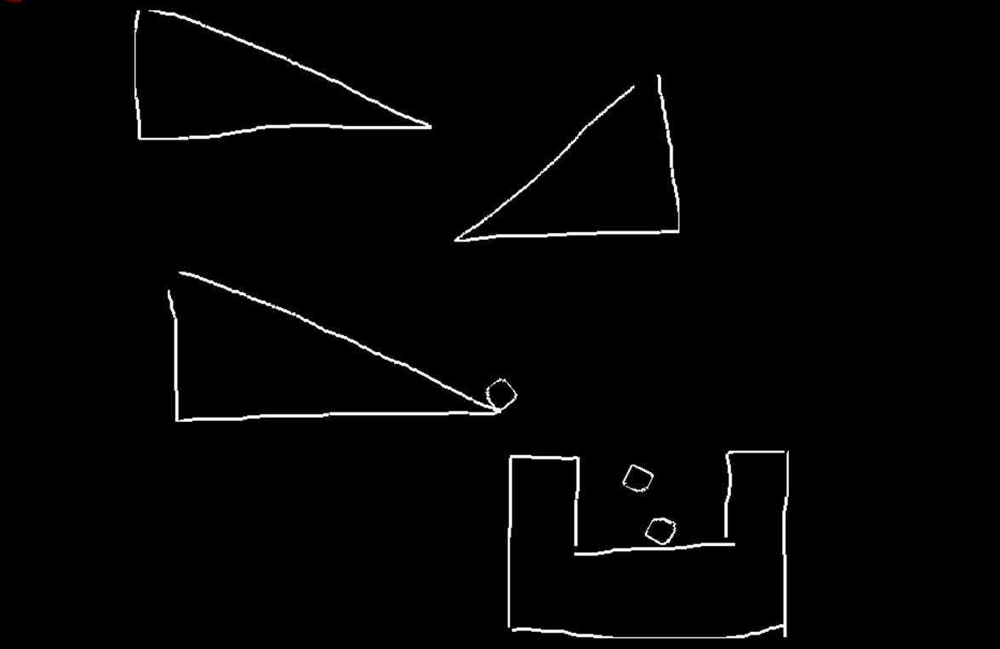
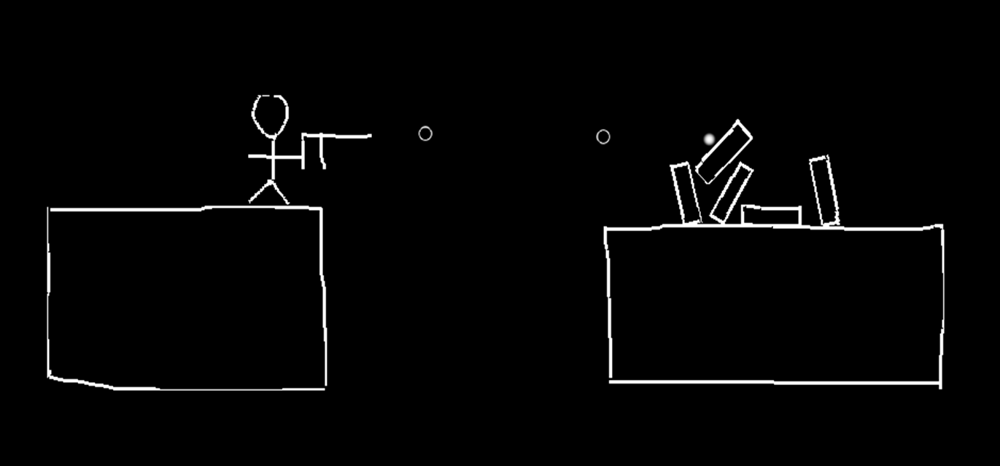

# Sketch2D
Sketch Game
A sketch draw and animate it in a physics world!

## Dev Env:
+ Visual Studio 2013
+ Windows 7 Home Baisc
+ Cocos2d-x 3.10 [Physics Engine: Chipmunks]

## Introduction
[View Video In Youku](http://v.youku.com/v_show/id_XMTg5NDY0NTg4MA==.html#paction)

## Development Guide
[Dev Guide](Documents/Reference Guide.md)

## Screenshots
+ A Simple Physics World

+ Groove, concave polygon supported

+ Car Going Downhill, skeleton joint constrains

+ Shooter, controled by your keyboard and mouse

+ Spring And Balls, it can elasitic when playing

